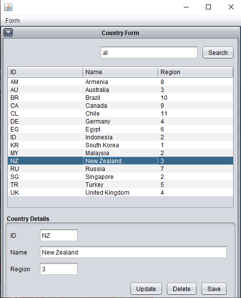
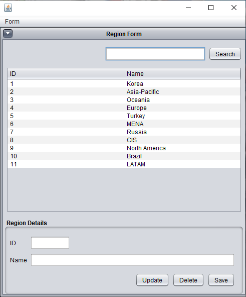

<h1 align="center">MCCOC - Valorant Regions and Countries</h1>

An app to show Regions and Countries available in Valorant.

<b>🎆 Gallery - Click to expand</b> 

<b>🚀 Features - Click to expand</b>

- [x] Show all regions available in Valorant
  - [x] Add region
  - [x] Update region
  - [x] Delete region  
- [x] Show all countries in Selected Regions
  - [x] Add country
  - [x] Update country
  - [x] Delete country  

